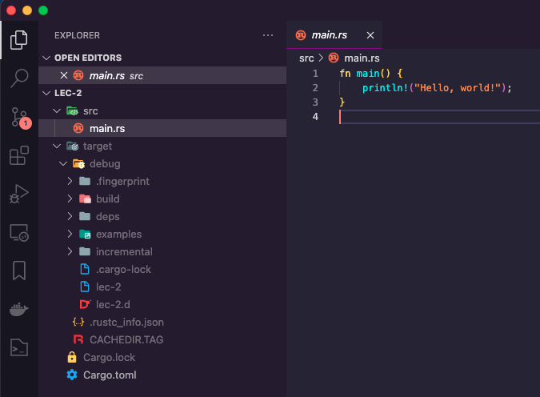

# prj_rust
Pruebas rust-lang.org

## errores
```
error: linking with `cc` failed: exit status: 1
= note: "cc" "-m64" "-arch" "x86_64" "/var/folders/yt/g9dtf4cj40s6m5b4m_rzjz8m0000gn/T/rustcnrHxH7/symbols.o
...
= note: ld: library not found for -lmysqlclient
  clang: error: linker command failed with exit code 1 (use -v to see invocation)
```
- habia que instalar `brew install mysql`

```rust
//comando para iniciar un paquete como binario (flag: --bin, por defecto) si se desea crear como libreria hay que usar --lib
cargo new <nombre-paquete>

//compilar nos movemos a la raiz del proyecto y ejecutamos
cargo run 

catgo --version
rustc --version
```

#### .gitignore sugerido
```yml
# https://github.com/github/gitignore/blob/main/Rust.gitignore
.vscode
.idea

# Generated by Cargo
# will have compiled files and executables
debug/
target/

# Remove Cargo.lock from gitignore if creating an executable, leave it for libraries
# More information here https://doc.rust-lang.org/cargo/guide/cargo-toml-vs-cargo-lock.html
Cargo.lock

# These are backup files generated by rustfmt
**/*.rs.bk

# MSVC Windows builds of rustc generate these, which store debugging information
*.pdb
```


[https://learnxinyminutes.com/docs/es-es/rust-es](https://learnxinyminutes.com/docs/es-es/rust-es)
